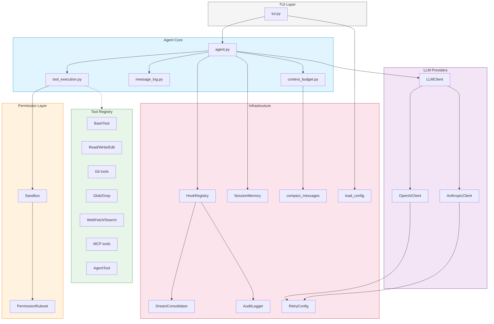
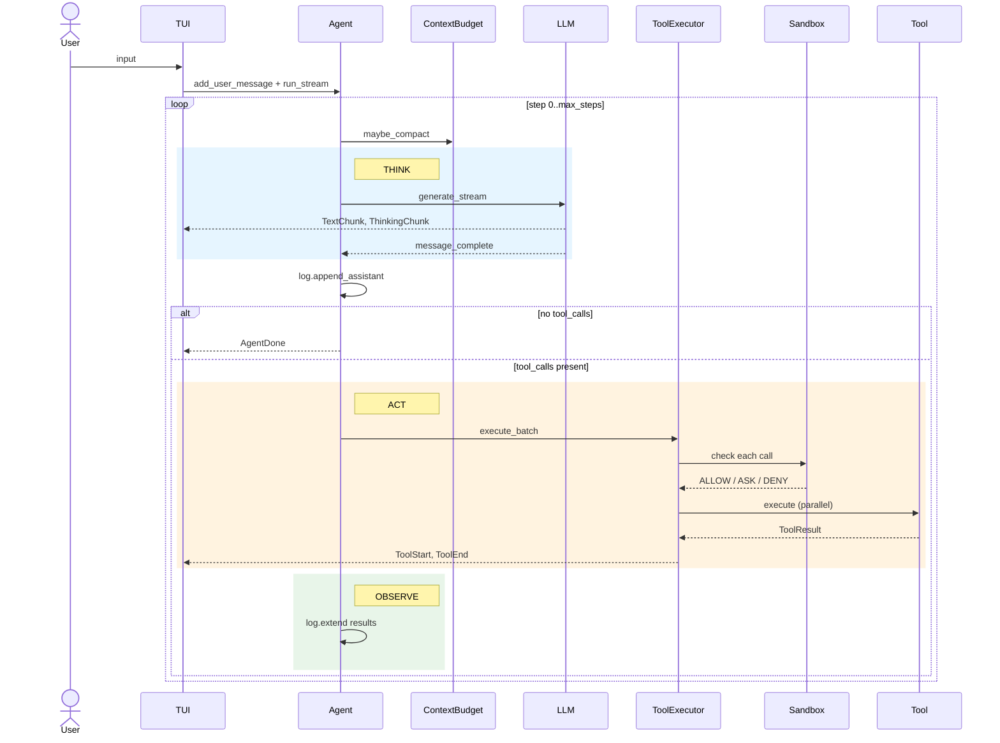
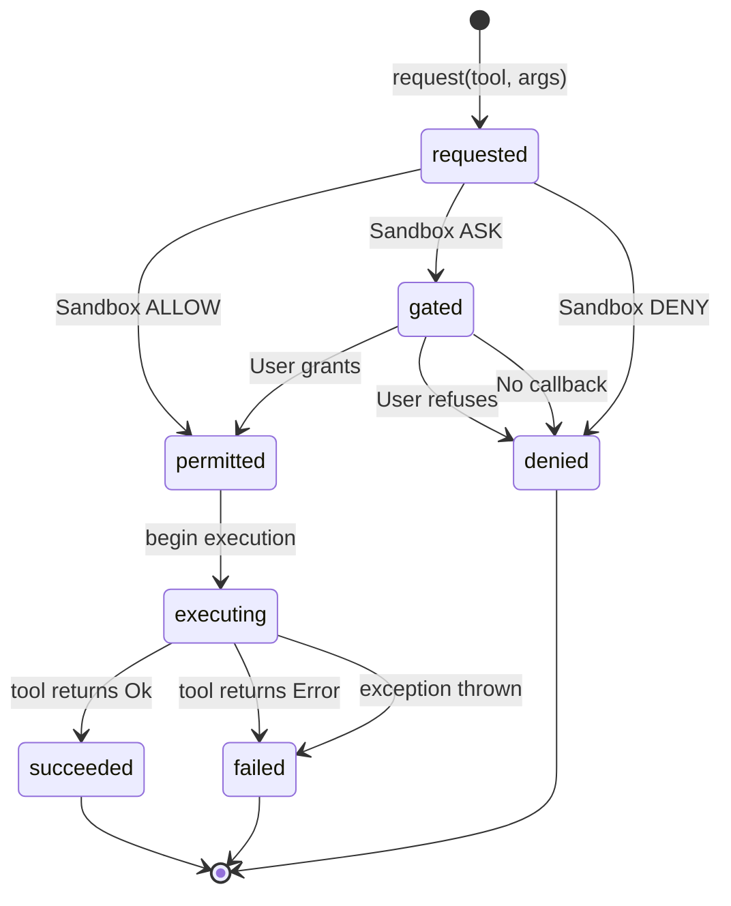
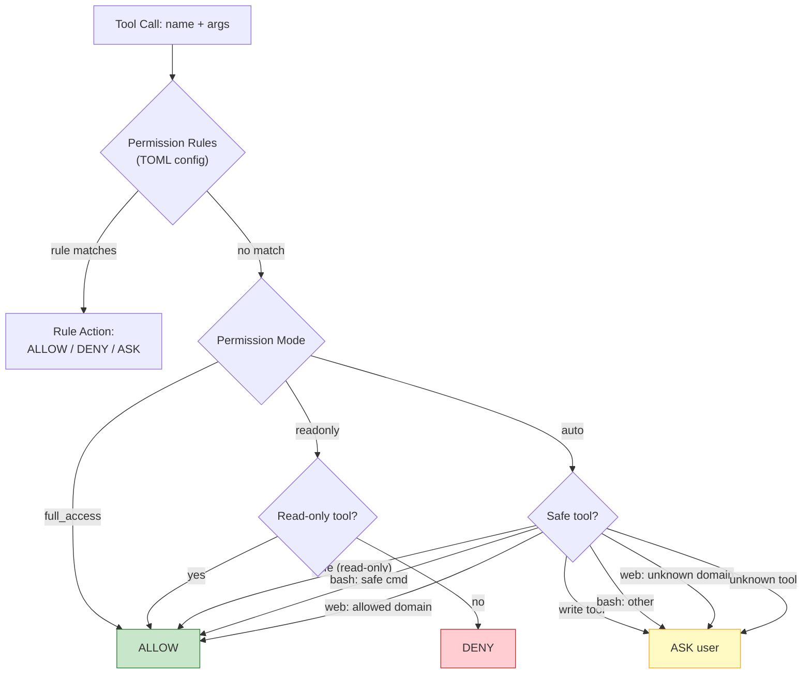
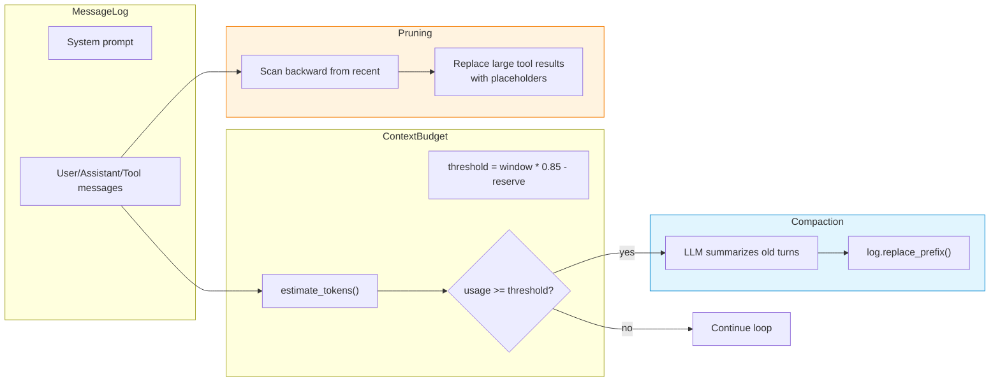
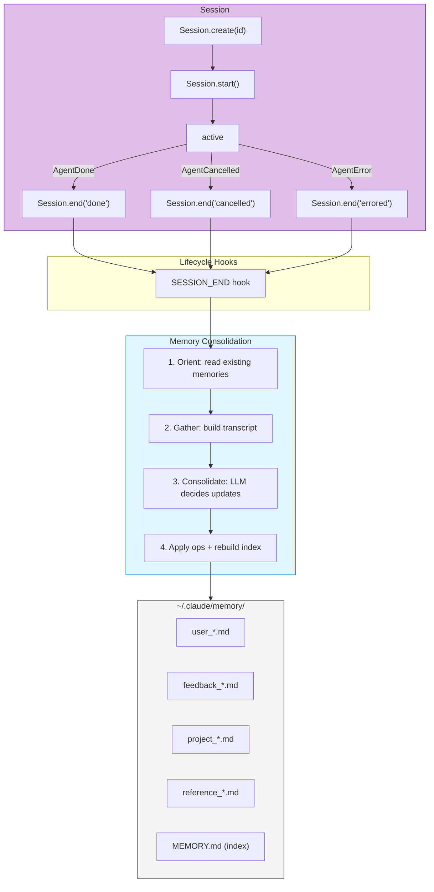
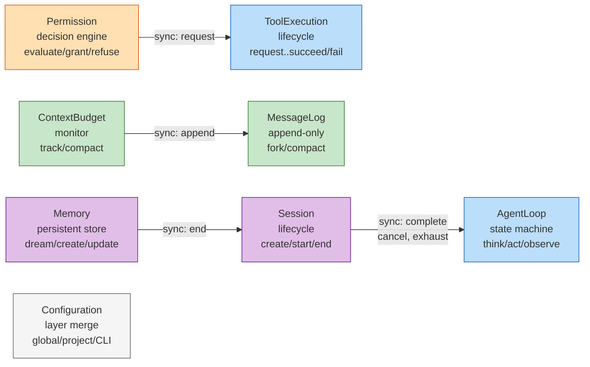
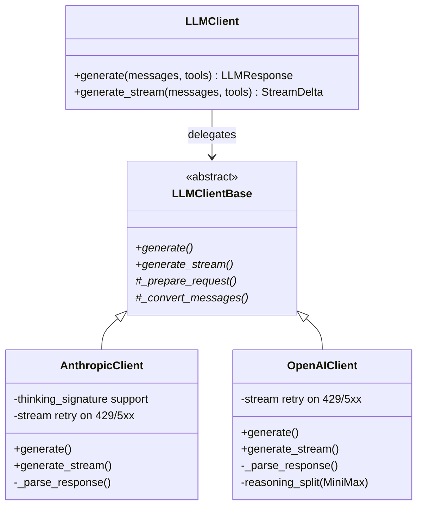
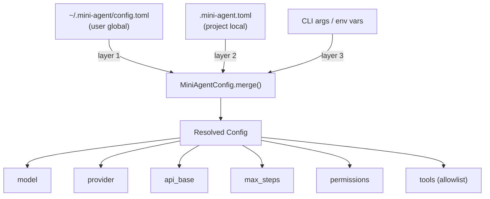

# Mini-Agent Architecture

## Overview

Mini-Agent is a ~5,600-line Python implementation of an LLM-powered coding agent. It provides a Claude Code-like REPL with streaming output, tool execution, permission sandboxing, context management, and cross-session memory.

```
mini_agent/
  agent.py            349 lines   Core agent loop (think-act-observe)
  tool_execution.py   159 lines   Tool permission + execution lifecycle
  message_log.py      102 lines   Append-only message history
  context_budget.py    78 lines   Context window monitoring + compaction
  context.py          565 lines   Compaction, pruning, system prompts
  sandbox.py          313 lines   Permission modes + command classification
  permissions.py      163 lines   TOML-based rule engine
  dream.py            340 lines   Cross-session memory consolidation
  tui.py              760 lines   Interactive REPL
  llm/                           Anthropic + OpenAI provider clients
  tools/                         Bash, file, git, glob, grep, web, MCP, sub-agent
```

---

## Module Dependency Graph



---

## Agent Loop (Think-Act-Observe)

The core loop in `agent.py:run_stream()` follows this cycle:



---

## Tool Execution Lifecycle

`ToolExecutor.execute_batch()` manages each tool call through a clean state progression:



---

## Permission Decision Flow

Three layers combine to produce a decision:



**Rule evaluation order**: Rules are walked in *reverse* — last-added rule wins. Project rules (appended after global rules) naturally override global defaults.

---

## Context Management



**Token estimation**: ~4 chars/token (conservative for code-heavy context). Compaction triggers at 85% of context window minus a 20K token reserve.

---

## Session Lifecycle & Memory



---

## Concept Map

The codebase is modeled by 8 Jackson-style concepts (specs in `concepts/*.concept`):



| Concept | File(s) | Purpose |
|---------|---------|---------|
| AgentLoop | `agent.py` | Bounded think-act-observe cycle |
| ToolExecution | `tool_execution.py` | Tool call permission + execution lifecycle |
| Permission | `sandbox.py` + `permissions.py` | Layered allow/deny/ask decisions |
| MessageLog | `message_log.py` | Ordered append-only message history |
| ContextBudget | `context_budget.py` | Monitor token usage, trigger compaction |
| Session | `agent.py` (lifecycle methods) | Bracket work with start/end hooks |
| Memory | `dream.py` | Cross-session knowledge consolidation |
| Configuration | `config.py` | Hierarchical config with layer overrides |

---

## LLM Provider Architecture



Both clients support:
- **Streaming**: Real-time token delivery via async generators
- **Tool calling**: Automatic format conversion (Anthropic/OpenAI schemas)
- **Extended thinking**: Anthropic thinking blocks with signature replay
- **Retry**: Transient error retry (429, 5xx) on both `generate()` and `generate_stream()`
- **Token tracking**: Usage accumulation from API responses

---

## Configuration Hierarchy



Later layers override earlier ones. Non-None scalars replace; non-empty tool lists replace entirely.

---

## Key Design Decisions

### Why extract ToolExecutor?
The permission-check + parallel-execute + result-collect logic was duplicated between `run_stream()` (170 lines) and `_execute_tool_calls()` (73 lines). Extracting it eliminated the duplication and made tool execution independently testable.

### Why extract MessageLog?
Agent directly manipulated `self.messages` as a raw list from 9 different places. MessageLog provides a single mutation point, enabling future features like automatic budget tracking on append, and making `fork()` testable in isolation.

### Why extract ContextBudget?
Compaction logic (estimate tokens, check threshold, summarize, fire hook) was inlined in the main agent loop. Extracting it made `run_stream()` focus purely on think-act-observe.

### Why defer AgentLoop state machine?
The agent loop's "state" is implicit in the program counter of `run_stream()`. Adding explicit status tracking would add ceremony without preventing bugs — the `self._running` guard already prevents concurrent execution.

### Why defer Session extraction?
Session lifecycle is only ~40 lines. Extracting it into a separate class would add overhead disproportionate to its size.

---

## File Size Summary

| File | Lines | Role |
|------|------:|------|
| tui.py | 760 | Interactive REPL |
| context.py | 565 | Compaction, pruning, system prompts |
| agent.py | 349 | Core agent loop |
| dream.py | 340 | Memory consolidation |
| sandbox.py | 313 | Permission modes |
| tools/bash_tool.py | 310 | Shell execution |
| tools/mcp_loader.py | 234 | MCP server connections |
| retry.py | 208 | Exponential backoff |
| session_memory.py | 205 | Periodic session snapshots |
| tools/git_tool.py | 435 | Git operations |
| tools/file_tools.py | 170 | Read/Write/Edit |
| permissions.py | 163 | TOML rule engine |
| tool_execution.py | 159 | Tool lifecycle |
| tools/grep_tool.py | 139 | Content search |
| tools/agent_tool.py | 160 | Sub-agent spawning |
| config.py | 117 | Hierarchical config |
| hooks.py | 106 | Lifecycle pub/sub |
| message_log.py | 102 | Message history |
| events.py | 96 | Event types |
| tools/web_fetch.py | 88 | URL fetching |
| context_budget.py | 78 | Context monitoring |
| tools/web_search.py | 122 | DuckDuckGo search |
| tools/glob_tool.py | 72 | File pattern matching |
| audit.py | 78 | JSONL transcript |
| cost.py | 53 | Cost estimation |
| log.py | 50 | Logging setup |
| schema/schema.py | 75 | Core data models |
